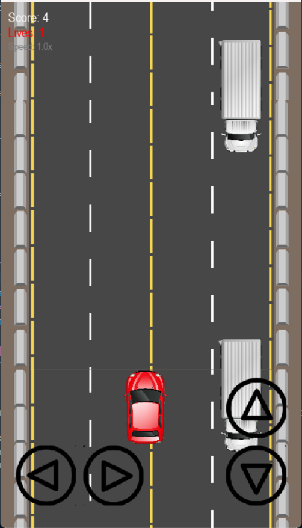

# 🚗 Car Dodge – Mobile-Friendly 2D Car Dodging Game

A mobile-optimized 2D arcade-style car dodging game built with **Pygame**. Dodge enemy vehicles, survive as long as you can, and beat your high score!

<p align="center">
  
</p>

---

## 🎮 Features

- Smooth scrolling road background  
- Increasing difficulty based on score  
- Lane-based enemy cars with dynamic lane changing  
- Mobile control buttons (touch-based)  
- Optional desktop keyboard controls  
- High score saving  
- Sound effects and background music  
- Integrated mobile ad system (placeholder)

---

## 📱 Mobile Controls

- Tap on-screen buttons for:
  - Left / Right movement
  - Up / Down dodging
- Game can be paused/resumed by tapping

---

## ⌨️ Desktop Controls (for testing)

- Arrow keys: Move player car  
- `Space`: Start / Restart game  
- `Esc`: Pause or return to main menu

---

## 🧠 Game Logic Highlights

- Smart enemy lane switching to avoid stacking  
- Touch and mouse event support  
- Dynamic difficulty: enemy speed increases with your score  
- Lane safety checking before enemy spawns  
- Light animation/fading effects on damage

---

## 📂 Assets Included

- `assets/`: Contains all sprites and sounds (cars, road, controls, music, crash)  
- `highscore.json`: Tracks local high score

---

## ▶️ How to Run

```bash
pip install pygame
python main.py
